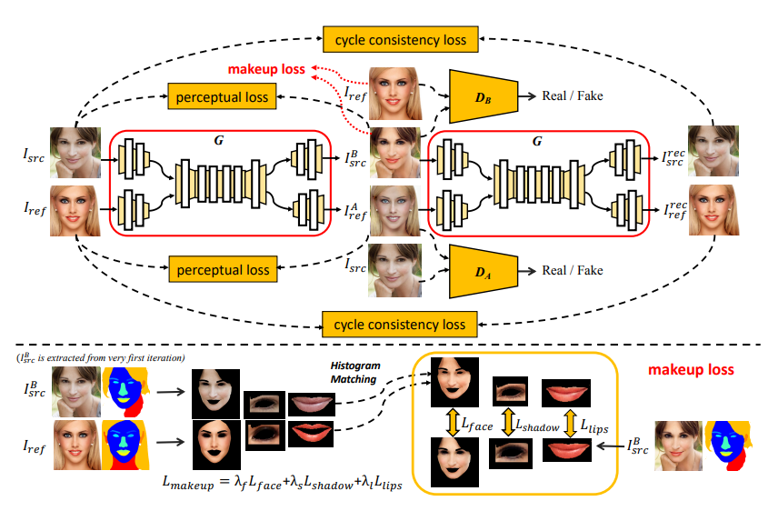

# BeautyGAN – Makeup Style Transfer

**PyTorch implementation of [BeautyGAN](https://doi.org/10.1145/3240508.3240618)**[1] – a GAN-based facial makeup style transfer model. BeautyGAN combines **global domain-level loss** with **local instance-level loss** in a **dual input/output GAN** framework to achieve realistic and identity-preserving makeup transfer.


*Figure: BeautyGAN \[1] framework*

---

## Overview

BeautyGAN can **apply, remove, or change makeup styles** between two face images.

This is a pytorch implementation and follows the approach in Li et al. \[1] and is trained on a curated makeup dataset.

---

## Dataset

The model is trained on the dataset curated by Li et al. \[2].

* Split: **80% training / 20% testing**
* Due to limited resources, only **400 images** are used for training in this implementation.
* For makeup loss, **facial parts are extracted** using `jonathandinu/face-parsing`[3]


**Download the dataset**:

```bash
python download_dataset.py
```

Original dataset: [Google Drive Link](https://drive.google.com/file/d/18UlvYDL6UGZ2rs0yaDsSzoUlw8KI5ABY/view)

---
## Visdom 
Before start training, run the below to start the visdom server to visualize the training. 

```
pip install visdom
python -m visdom.server
```

## Training
```bash
python train.py
```

## Testing
```
bash
python test.py
```

## Results

## 📚 References

\[1] Tingting Li, Ruihe Qian, Chao Dong, Si Liu, Qiong Yan, Wenwu Zhu, and Liang Lin. *BeautyGAN: Instance-level Facial Makeup Transfer with Deep Generative Adversarial Network.* In Proceedings of the 26th ACM International Conference on Multimedia (MM '18), pp. 645–653. ACM, 2018. [DOI](https://doi.org/10.1145/3240508.3240618)

\[2] Dataset: [Google Drive Link](https://drive.google.com/file/d/18UlvYDL6UGZ2rs0yaDsSzoUlw8KI5ABY/view)

\[3] https://huggingface.co/jonathandinu/face-parsing

